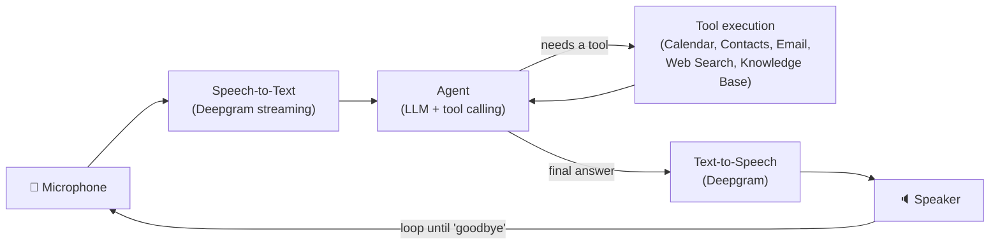

# 🎙️ NexVoice

**A voice-first AI assistant that listens, reasons, and takes action for you.**

NexVoice turns natural speech into real work. Talk to it the way you'd talk to a person — "book me a meeting with Sarah tomorrow at 3", "email John the update", "what's the latest on the news" — and it transcribes your voice, figures out what you actually need, calls the right tool to get it done, and speaks the answer back to you.

<p align="center">
  
  
  
</p>

---

## Table of Contents

- [What It Does](#what-it-does)
- [How It Works](#how-it-works)
- [Available Tools](#available-tools)
- [Project Structure](#project-structure)
- [Getting Started](#getting-started)
  - [1. Prerequisites](#1-prerequisites)
  - [2. Clone & Install](#2-clone--install)
  - [3. Configure Environment Variables](#3-configure-environment-variables)
  - [4. Set Up Google API Access](#4-set-up-google-api-access)
  - [5. (Optional) Set Up the Personal Knowledge Base](#5-optional-set-up-the-personal-knowledge-base)
- [Running NexVoice](#running-nexvoice)
- [Choosing a Language Model](#choosing-a-language-model)
- [Extending NexVoice with New Tools](#extending-nexvoice-with-new-tools)
- [Troubleshooting](#troubleshooting)
- [Contributing](#contributing)
- [License](#license)

---

## What It Does

NexVoice combines real-time speech recognition, a tool-calling LLM agent, and natural-sounding voice synthesis into a single conversational loop. It's built to feel less like "running a script" and more like talking to an assistant that can actually get things done:

- 🎧 **Speech-to-Text** — streams your microphone audio and transcribes it live as you speak.
- 🧠 **Reasoning & Tool Use** — an LLM-powered agent decides whether it can just answer you directly, or whether it needs to call a tool (calendar, contacts, email, web search, your own notes) to fulfill the request.
- 🔊 **Text-to-Speech** — speaks the final answer back out loud, so the whole interaction stays hands-free.
- 🔁 **Continuous Conversation** — keeps listening and responding in a loop until you say "goodbye".

## How It Works

Every request flows through the same pipeline, from raw audio in to spoken audio out:



Under the hood:

1. **`ConversationManager`** drives the main loop — it waits for you to finish speaking, sends the transcript to the agent, and speaks back whatever the agent returns.
2. **`Agent`** (powered by [LiteLLM](https://github.com/BerriAI/litellm), so it works with Groq, Gemini, or any other supported provider) holds the conversation history, decides if a tool call is needed, executes it, and feeds the result back to the model to produce a final, natural-language response.
3. **Tools** are small, self-contained Pydantic classes that the LLM can invoke with structured arguments — each one wraps a real-world action or a data lookup.

## Available Tools

| Tool | What it does | Requires |
|---|---|---|
| 🗓️ **CalendarTool** | Books an event on Google Calendar with a name, date/time, and optional description | Google Calendar API |
| 👤 **AddContactTool** | Adds a new contact (name, phone, optional email) to Google Contacts | Google People API |
| 🔎 **FetchContactTool** | Looks up an existing contact's phone number / email by name | Google People API |
| ✉️ **EmailingTool** | Sends an email through Gmail — automatically resolves the recipient's address via `FetchContactTool` | Gmail App Password |
| 🌐 **SearchWebTool** | Runs a live web search to answer questions about current events or facts | Tavily API key |
| 📚 **KnowledgeSearchTool** *(optional)* | Answers questions using your own documents via a local retrieval-augmented-generation (RAG) pipeline | Gemini API key + a local vector index |

New tools are easy to add — see [Extending NexVoice with New Tools](#extending-nexvoice-with-new-tools).

## Project Structure

```
NexVoice/
├── main.py                          # Entry point — wires up the agent, tools, and conversation loop
├── requirements.txt                 # Python dependencies
├── scripts/
│   ├── create_index.py              # Builds the local vector store from files in ./files
│   └── fetch_index.py               # Standalone script for querying the knowledge base directly
└── src/
    ├── utils.py                     # Shared constants (Google API OAuth scopes)
    ├── agents/
    │   └── agent.py                 # Core Agent class: conversation state + tool-calling loop
    ├── prompts/
    │   └── prompts.py                # System prompt and RAG prompt templates
    ├── speech_processing/
    │   ├── conversation_manager.py  # Orchestrates the listen → think → speak loop
    │   ├── speech_to_text.py         # Live microphone transcription (Deepgram)
    │   └── text_to_speech.py         # Converts agent responses to spoken audio (Deepgram)
    └── tools/
        ├── base_tool.py             # Abstract base class all tools inherit from
        ├── calendar/calendar_tool.py
        ├── contacts/
        │   ├── add_contact_tool.py
        │   └── fetch_contact_tool.py
        ├── emails/emailing_tool.py
        └── search/
            ├── search_web_tool.py
            └── knowledge_base_tool.py
```

## Getting Started

### 1. Prerequisites

- **Python 3.9+**
- A working **microphone** and audio output
- `PyAudio` needs the system-level **PortAudio** library:
  - macOS: `brew install portaudio`
  - Ubuntu/Debian: `sudo apt-get install portaudio19-dev`
  - Windows: usually works out of the box via the prebuilt `PyAudio` wheel

You'll also want API keys for the services NexVoice talks to:

| Service | Used for | Get a key |
|---|---|---|
| [Deepgram](https://deepgram.com/) | Speech-to-text & text-to-speech | [console.deepgram.com](https://console.deepgram.com/) |
| [Groq](https://groq.com/) | Fast LLM inference (Llama 3) | [console.groq.com](https://console.groq.com/) |
| [Google AI Studio](https://aistudio.google.com/) | Gemini model & embeddings (optional, for the knowledge base tool) | [aistudio.google.com](https://aistudio.google.com/) |
| [Tavily](https://tavily.com/) | Real-time web search | [app.tavily.com](https://app.tavily.com/) |
| Google Cloud Console | Calendar & Contacts access | [console.cloud.google.com](https://console.cloud.google.com/) |

### 2. Clone & Install

```sh
git clone https://github.com/NALLAMOTURENU/NexVoice.git
cd NexVoice

# create and activate a virtual environment
python -m venv venv
source venv/bin/activate        # Windows: venv\Scripts\activate

# install dependencies
pip install -r requirements.txt
```

### 3. Configure Environment Variables

Create a `.env` file in the project root:

```env
# Speech
DEEPGRAM_API_KEY=your_deepgram_api_key

# LLM providers
GROQ_API_KEY=your_groq_api_key
GEMINI_API_KEY=your_gemini_api_key

# Web search
TAVILY_API_KEY=your_tavily_api_key

# Gmail sending (used by EmailingTool)
GMAIL_MAIL=your_gmail_address@gmail.com
GMAIL_APP_PASSWORD=your_gmail_app_password
```

> 💡 `GMAIL_APP_PASSWORD` is a Gmail **App Password**, not your regular login password. Generate one from your [Google Account security settings](https://myaccount.google.com/apppasswords) (requires 2-Step Verification to be enabled).

### 4. Set Up Google API Access

`CalendarTool`, `AddContactTool`, and `FetchContactTool` authenticate via OAuth using Google's official client libraries.

1. Go to the [Google Cloud Console](https://console.cloud.google.com/) and create a new project (or reuse one).
2. Enable the **Google Calendar API** and the **Google People API** for that project.
3. Under **APIs & Services → Credentials**, create an **OAuth client ID** of type "Desktop app".
4. Download the resulting JSON file, rename it to `credentials.json`, and place it in the project root.
5. The first time you run a Google-backed tool, a browser window will open asking you to sign in and grant access. A `token.json` file will then be saved locally so you don't have to log in again.

### 5. (Optional) Set Up the Personal Knowledge Base

The `KnowledgeSearchTool` lets NexVoice answer questions from your own documents (notes, PDFs, text files, etc.) instead of the open web.

```sh
mkdir files
# drop your documents (.txt, .pdf, .md, etc.) into the files/ folder

python scripts/create_index.py
```

This builds a local Chroma vector store (`db/`) from your documents using Gemini embeddings. Once it's built, uncomment `KnowledgeSearchTool` in the `tools_list` inside `main.py` to activate it.

## Running NexVoice

```sh
python main.py
```

Speak naturally once you see `Listening...` in the terminal. A few things to try:

- "Schedule a meeting with the design team tomorrow at 2 PM."
- "Add a new contact — Jane Doe, phone 555-123-4567."
- "What's Mark's email address?"
- "Send an email to Alex with the subject 'Project Update' and let them know we're on track."
- "Search the web for the latest news on AI."
- *(if the knowledge base is enabled)* "What did I write in my meeting notes about the Q3 roadmap?"

Say **"goodbye"** at any point to end the conversation and stop the program.

## Choosing a Language Model

Because the agent is built on [LiteLLM](https://github.com/BerriAI/litellm), swapping models is a one-line change in `main.py`:

```python
model = "groq/llama3-70b-8192"
# model = "groq/llama-3.1-70b-versatile"
# model = "gemini/gemini-1.5-pro"
```

Any model LiteLLM supports (and that also supports function/tool calling) can be dropped in here.

## Extending NexVoice with New Tools

Every tool is a small `pydantic`-backed class that describes its own parameters — the LLM reads the docstring and field descriptions to decide when and how to call it. Adding a new capability is just:

```python
from pydantic import Field
from src.tools.base_tool import BaseTool

class WeatherTool(BaseTool):
    """Gets the current weather for a given city."""

    city: str = Field(description="The city to get the weather for")

    def run(self):
        # ... call a weather API and return a string result ...
        return f"It's sunny in {self.city}."
```

Then register it in `main.py`:

```python
from src.tools.weather.weather_tool import WeatherTool

tools_list = [
    CalendarTool,
    AddContactTool,
    FetchContactTool,
    EmailingTool,
    SearchWebTool,
    WeatherTool,
]
```

That's it — the agent automatically builds the tool schema and can start calling it in conversation.

## Troubleshooting

| Issue | Likely fix |
|---|---|
| `PyAudio` fails to install | Install PortAudio first (see [Prerequisites](#1-prerequisites)) |
| No transcription happens / "Listening..." never updates | Check your microphone permissions and that `DEEPGRAM_API_KEY` is set |
| Google tools raise auth errors | Delete `token.json` and re-run to trigger a fresh OAuth flow |
| `EmailingTool` fails to send | Confirm `GMAIL_APP_PASSWORD` is an App Password, not your account password, and that the recipient exists in Google Contacts |
| Knowledge base tool returns nothing useful | Make sure `scripts/create_index.py` has been run after adding files to `files/` |

## Contributing

Contributions, ideas, and bug reports are all welcome. Feel free to open an issue or submit a pull request.

## License

This project does not yet have a formal license attached. If you'd like to use, modify, or distribute this code, please reach out first.
